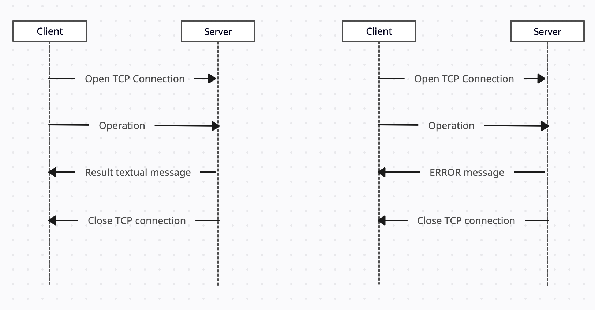

# Protocol "calculator19TH"
## Section 1 : overview
calculator19TH is a client-server protocol. The client connects to a server and send an operation (addition, subtraction, multiplication and division). The server send the result back, if a character is not define return an error.

## Section 2: transport layer protocol
calculator19TH uses TCP. The client establishes the connection. It has to know the IP address of the server. The server listens on TCP port 1234.
The server closes the connection when the result or the error message has been sent. 

## Section 3: messages
There are five types of messages:
- ADD \<operand1> \<operand2>
   - The client requests to add operand1 with operand2.
- SUB \<operand1> \<operand2>
  - The client requests to subtract operand1 with operand2.
- MUL \<operand1> \<operand2>
  - The client requests to multiply operand1 with operand2.
- DIV \<operand1> \<operand2>
  - The client requests to divide operand1 with operand2.
- ERROR 
  - Error response message after an incorrect operation

Messages are UTF-8 encoded with “\n” as end-of-line character.
The server sends the result as textual message.

## Section 4 : example dialogs

